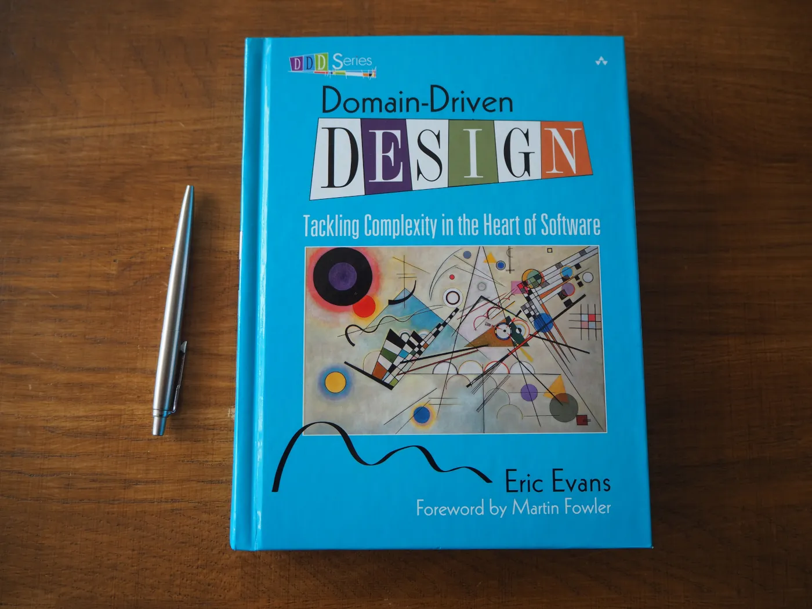

  

*"Domain modeling is not a matter of making as “realistic” a model as possible. Even in a domain of tangible real-world things, our model is an **artificial creation**. Nor is it just the construction of a software mechanism that gives the necessary results. It is more like moviemaking, **loosely representing reality to a particular purpose**."*

This is a repository to save my learning progress

 

 

**Summary:**

 [Important terms in Domain-Driven Design](#p01)

* [Domain logic](#t01)
* [Domain model](#t02)
* [Subdomain](#t03)
* [Design patterns](#t04)
* [Bounded context](#t05)
* [The Ubiquitous Language](#t06)
* [Entities](#t07)
* [Value objects and aggregates](#t08)
* [Domain service](#t09)
* [Repository](#t10)

 [Example of Domain-Driven Design](#p02)

* [Example](#t11)

 
<h2 id="p01">Important terms in Domain-Driven Design</h2>
<h3 id="t01">Domain logic</h3>

 Domain logic is the purpose of your modeling. Most commonly, it’s referred to as the business logic. This is where your business rules define the way data gets created, stored, and modified.

 
<h3 id="t02">Domain model</h3>

 Domain model includes the ideas, knowledge, data, metrics, and goals that revolve around that problem you’re trying to solve. It contains all the rules and patterns that will help you deal with complex business logic. Moreover, they will be useful to meet the requirements of your business.

 
<h3 id="t03">Subdomain</h3>

 A domain consists of several subdomains that refer to different parts of the business logic. For example, an online retail store could have a product catalog, inventory, and delivery as its subdomains.

 
<h3 id="t04">Design patterns</h3>

 Design patterns are all about reusing code. No matter the complexity of the problem you encounter, someone who’s been doing object-oriented programming has probably already created a pattern that will help you solve it. Breaking down your problem into its initial elements will lead you to its solution. Everything you learn through patterns, you can later use for any object-oriented language you start to program in.

 
<h3 id="t05">Bounded context</h3>

 Bounded context is a central pattern in domain-driven design that contains the complexity of the application. It handles large models and teams. This is where you implement the code, after you’ve defined the domain and the subdomains.

 Bounded contexts actually represent boundaries in which a certain subdomain is defined and applicable. Here, the specific subdomain makes sense, while others don’t. One entity can have different names in different contexts. When a subdomain within the bounded context changes, the entire system doesn’t have to change too. That’s why developers use adapters between contexts.

 
<h3 id="t06">The Ubiquitous Language</h3>

 The Ubiquitous Language is a methodology that refers to the same language domain experts and developers use when they talk about the domain they are working on. This is necessary because projects can face serious issues with a disrupted language. This happens because domain experts use their own jargon. At the same time, tech professionals use their own terms to talk about the domain.

 There’s a gap between the terminology used in daily discussions and the terms used in the code. That’s why it’s necessary to define a set of terms that everyone uses. All the terms in the ubiquitous language are structured around the domain model.

 
<h3 id="t07">Entities</h3>

 Entities are a combination of data and behavior, like a user or a product. They have identity, but represent data points with behavior.

 
<h3 id="t08">Value objects and aggregates</h3>

 Value objects have attributes, but can’t exist on their own. For example, the shipping address can be a value object. Large and complicated systems have countless entities and value objects. That’s why the domain model needs some kind of structure. This will put them into logical groups that will be easier to manage. These groups are called aggregates. They represent a collection of objects that are connected to each other, with the goal to treat them as units. Moreover, they also have an aggregate root. This is the only entity that any object outside of the aggregate can reference to.

 
<h3 id="t09">Domain service</h3>

 The domain service is an additional layer that also contains domain logic. It’s part of the domain model, just like entities and value objects. At the same time, the application service is another layer that doesn’t contain business logic. However, it’s here to coordinate the activity of the application, placed above the domain model.

 
<h3 id="t10">Repository</h3>

 The repository pattern is a collection of business entities that simplifies the data infrastructure. It releases the domain model from infrastructure concerns. The layering concept enforces the separation of concerns.

<h2 id="p02">Example of Domain-Driven Design</h2>
<h3 id="t11">Example</h3>

      To be implemented
